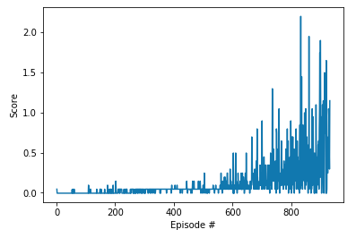

[//]: # (Image References)
[image1]: https://user-images.githubusercontent.com/10624937/42135623-e770e354-7d12-11e8-998d-29fc74429ca2.gif "Trained Agent"
[image2]: https://user-images.githubusercontent.com/10624937/42135622-e55fb586-7d12-11e8-8a54-3c31da15a90a.gif "Soccer"

# Report: "Project " - Collaboration and Competition - Multi-Agent RL"

We will train a system of DeepRL agents to demonstrate collaboration or cooperation on a complex task.

## Architecture

+ This image represents the flow of processes in a reinforcement learning training cycle.

+ In this project, we use Unity like environment simulator engine and we use the PyTorch framework to build the deep RL agent.

+ The next image defines the block diagram of ML-Agents toolkit for our sample environment. 
+ In our project, we use 2 agent.

+ The next image defines the architecture of MADDPG 
  

+ The next image overviews the flow of MADDPG 
  

## Unity Environment

+ Set-up: Two-player game where agents control rackets to bounce ball over a net.
+ Goal: The agents must bounce ball between one another while not dropping or sending ball out of bounds.
+ Agents: The environment contains two agent linked to a single Brain named TennisBrain. After training you can attach another Brain named MyBrain to one of the agent to play against your trained model.
+ Agent Reward Function (independent):
  + +0.1 To agent when hitting ball over net.
  + -0.1 To agent who let ball hit their ground, or hit ball out of bounds.
+ Brains: One Brain with the following observation/action space.
  + Vector Observation space: 8 variables corresponding to position and velocity of ball and racket.
  + Vector Action space: (Continuous) Size of 2, corresponding to movement toward net or away from net, and jumping.
  + Visual Observations: None.
+ Reset Parameters: One, corresponding to size of ball.
+ Benchmark Mean Reward: 2.5
+ Optional Imitation Learning scene: TennisIL

![Trained Agent][image1]

In this environment, two agents control rackets to bounce a ball over a net. If an agent hits the ball over the net, it receives a reward of +0.1.  If an agent lets a ball hit the ground or hits the ball out of bounds, it receives a reward of -0.01.  Thus, the goal of each agent is to keep the ball in play.

The observation space consists of 8 variables corresponding to the position and velocity of the ball and racket. Each agent receives its own, local observation.  Two continuous actions are available, corresponding to movement toward (or away from) the net, and jumping. 

The task is episodic, and in order to solve the environment, your agents must get an average score of +0.5 (over 100 consecutive episodes, after taking the maximum over both agents). Specifically,

- After each episode, we add up the rewards that each agent received (without discounting), to get a score for each agent. This yields 2 (potentially different) scores. We then take the maximum of these 2 scores.
- This yields a single **score** for each episode.

The environment is considered solved, when the average (over 100 episodes) of those **scores** is at least +0.5.

~~~~
INFO:unityagents:
'Academy' started successfully!
Unity Academy name: Academy
        Number of Brains: 1
        Number of External Brains : 1
        Lesson number : 0
        Reset Parameters :
		
Unity brain name: TennisBrain
        Number of Visual Observations (per agent): 0
        Vector Observation space type: continuous
        Vector Observation space size (per agent): 8
        Number of stacked Vector Observation: 3
        Vector Action space type: continuous
        Vector Action space size (per agent): 2
        Vector Action descriptions: , 
~~~~

~~~~
Number of agents: 2
Size of each action: 2
There are 2 agents. Each observes a state with length: 24
The state for the first agent looks like: [ 0.          0.          0.          0.          0.          0.
  0.          0.          0.          0.          0.          0.
  0.          0.          0.          0.         -6.65278625 -1.5
 -0.          0.          6.83172083  6.         -0.          0.        ]
~~~~

## Code

The code is written in PyTorch 0.4 and Python 3.6.2.

Main Files:  
*TODO*

+ ./apps/Reacher.app : Contains the unity app. This app will simulate the Unity environment.
+ ddpq_agent.py: This code defines the ddpg agent.
+ model.py: This code defines de model of Neural Network architecture.
+ Continuous_Control_Rober.ipynb: This notebook will train the agent.
+ ./cp folder: Contains the checkpoints of models of the successful agent.

## Learning Algorithm
*TODO*

We implement an artificial agent, termed [Deep Deterministic Policy Gradient](https://spinningup.openai.com/en/latest/algorithms/ddpg.html)(DDPG)

DDPG is an algorithm which concurrently learns a Q-function and a policy. It uses off-policy data and the Bellman equation to learn the Q-function, and uses the Q-function to learn the policy.

+ DDPG is an off-policy algorithm.
+ DDPG can only be used for environments with continuous action spaces.
+ DDPG can be thought of as being deep Q-learning for continuous action spaces.
+ DDPG can be implemented with parallelization

DDPG is a similarly foundational algorithm to VPG. DDPG is closely connected to Q-learning algorithms, and it concurrently learns a Q-function and a policy which are updated to improve each other.

Algorithms like DDPG and Q-Learning are off-policy, so they are able to reuse old data very efficiently. They gain this benefit by exploiting Bellman’s equations for optimality, which a Q-function can be trained to satisfy using any environment interaction data (as long as there’s enough experience from the high-reward areas in the environment).

### DDPG Flowchart

+ Ref: https://nervanasystems.github.io/coach/algorithms/policy_optimization/ddpg/

### DDPG Pseudocode

+ Ref: https://spinningup.openai.com/en/latest/algorithms/ddpg.html#the-policy-learning-side-of-ddpg
  

### Hyper Parameters
#### DDPG Parameters

+ BUFFER_SIZE = int(1e6)        # replay buffer size
+ BATCH_SIZE = 1024             # minibatch size
+ GAMMA = 0.99                  # discount factor
+ TAU = 1e-3                    # for soft update of target parameters
+ LR_ACTOR = 1e-3               # learning rate of the actor 
+ LR_CRITIC = 1e-3              # learning rate of the critic before: 3e-4
+ WEIGHT_DECAY = 0.0000         # L2 weight decay
+ EPSILON = 1.0                 # noise factor
+ EPSILON_DECAY = 1e-6          # decay of noise factor

#### Neural Network. Model Architecture & Parameters
For this project we use these models:

~~~~
Actor Model:
  (bn0): BatchNorm1d(33, eps=1e-05, momentum=0.1, affine=True, track_running_stats=True)
  (fc1): Linear(in_features=33, out_features=128, bias=True)
  (bn1): BatchNorm1d(128, eps=1e-05, momentum=0.1, affine=True, track_running_stats=True)
  (fc2): Linear(in_features=128, out_features=128, bias=True)
  (bn2): BatchNorm1d(128, eps=1e-05, momentum=0.1, affine=True, track_running_stats=True)
  (fc3): Linear(in_features=128, out_features=4, bias=True)

Critic Model:
  (bn0): BatchNorm1d(33, eps=1e-05, momentum=0.1, affine=True, track_running_stats=True)
  (fcs1): Linear(in_features=33, out_features=128, bias=True)
  (fc2): Linear(in_features=132, out_features=128, bias=True)
  (fc3): Linear(in_features=128, out_features=1, bias=True)
~~~~

### Training

### Plot of Rewards

Environment solved in 170 episodes!	Average Score: 30.06
A plot of rewards per episode is included to illustrate that:

+ [ ] the agent receives an average reward (over 100 episodes) of at least +30
+ [x] the agent is able to receive an average reward (over 100 episodes, and over all 20 agents) of at least +30.

### Watch The DDPG Agent in Action

Video of trained DDPG Agent:

[youtube video](https://youtu.be/h6WyDX4cvek)
<!--- 

--->

### Ideas for Future Work

Future ideas for improving the agent's performance.

+ Try new algorithms like PPO, A3C, and D4PG that use multiple (non-interacting, parallel) copies of the same agent to distribute the task of gathering experience

+ Try new algorithm [Hierarchical Actor Critic (HAC)](https://arxiv.org/abs/1712.00948.pdf) [code](https://github.com/NervanaSystems/coach/blob/master/rl_coach/agents/ddpg_hac_agent.py). HAC enables agents to learn to break down problems involving continuous action spaces into simpler subproblems belonging to differenttime scales. The ability to learn at different resolutions in time may help overcome one of the main challenges in deep reinforcement learning — sample efficiency.
+ Try new algorithm [Hindsight Experience Replay (HER)](https://arxiv.org/abs/1707.01495.pdf) [code](https://github.com/NervanaSystems/coach/blob/master/rl_coach/memories/episodic/episodic_hindsight_experience_replay.py) 
  + [Video HER: Vanilla DDPG vs DDPG video](https://www.youtube.com/watch?time_continue=130&v=Dz_HuzgMxzo )

#### New References
1. [Measuring collaborative emergent behavior in multi-agent reinforcement learning](https://www.researchgate.net/publication/326570321_Measuring_collaborative_emergent_behavior_in_multi-agent_reinforcement_learning)
#### References
1. [Udacity Gihub Repo](https://github.com/udacity/deep-reinforcement-learning)
2. [Unity Docs](https://github.com/Unity-Technologies/ml-agents/blob/master/docs/ML-Agents-Overview.md)
3. [Unity Paper](https://arxiv.org/abs/1809.02627)
4. [OpenAI master RL](https://spinningup.openai.com/en/latest/algorithms/ddpg.html)
5. [DDPG paper](https://arxiv.org/abs/1509.02971)
6. [OpenAI Baselines](https://blog.openai.com/better-exploration-with-parameter-noise/)
7. [Book: Deep Reinforcement Learning Hands-On](https://github.com/PacktPublishing/Deep-Reinforcement-Learning-Hands-On)
8. [PyTorch Agent Net: reinforcement learning toolkit for pytorch](https://github.com/Shmuma/ptan)
9. [Reinforcement Learning Coach by Intel® AI Lab](https://nervanasystems.github.io/coach/)
10. [RL Coach - DDPG - Docs](https://nervanasystems.github.io/coach/algorithms/policy_optimization/ddpg/)
11. [RL Coach - DDPG - Code](https://github.com/NervanaSystems/coach/blob/master/rl_coach/agents/ddpg_agent.py)
12. [Modularized Implementation of Deep RL Algorithms in PyTorch](https://github.com/ShangtongZhang/DeepRL)